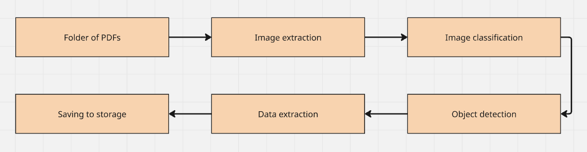

# Main pipeline

The core pipeline is defined in `api.py`. It is accessed through the `parse_folder` function. In a previous implementation, all PDFs would go through one part of the pipeline and then continue to the next. Currently, each PDF goes through the entire pipeline individually. A hash of the PDF is saved to a local disk cache once the PDF has gone through each desired stage. This hash is checked each iteration. As a result, duplicate PDFs or already processed PDFs from previous runs are skipped. 

ImageSet and PdfSet defined in `schema.py` are first constructed from JSONL of previous runs, if one exists. These sets are then updated each loop. This allows for the program to continue from where it left off in the event of an interruption. The sets have methods for inserting both raw and parsed data from each stage. Metadata is saved in the extraction part, while other stages lack it. Useful metadata for classifier, OCR, and VLM could be the model used.