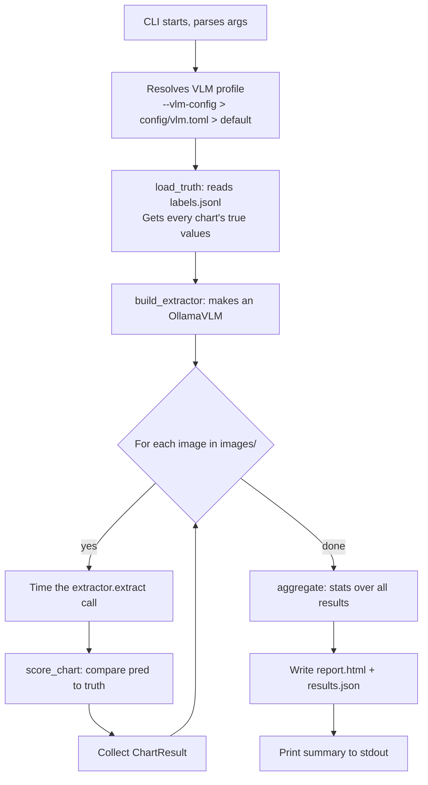

# Architecture (gentle version)

> Senior version: [../Architecture.md](../Architecture.md). This file
> covers the same ground with more context.

## The 30-second story

We have three pieces that work together:

1. **A chart generator** — draws fake bar charts and line charts, and
   saves the answers we used to draw them.
2. **An extractor** — looks at a chart image and tries to figure out what
   the answers are.
3. **A scorer** — compares what the extractor said to what we know is
   true, and writes a report.

The trick is that **all three pieces agree on the shape of "the answer"**.
That shape is called `ChartData`. Everything in this layer revolves around
`ChartData`.

## A picture

```
              ╔═══════════════════════════════════════════════════════════╗
              ║   schema.py                                               ║
              ║   The shared shape: ChartData, Series, Point              ║
              ║   (only imports pydantic + Python stdlib — no big libs)   ║
              ╚═══════════════════════════════════════════════════════════╝
                                ▲                          ▲
                                │                          │
                  "returns this"│                "checks against this"
                                │                          │
              ┌─────────────────┴────────────┐    ┌────────┴───────────────┐
              │ Extractors                   │    │ Scorer                  │
              │  • OllamaVLM (vlm.py)        │    │  benchmark.py          │
              │  • NoisyOracle (test double) │    │  • score_chart         │
              │  • (future) CV+OCR pipeline  │    │  • aggregate           │
              └─────────────────┬────────────┘    │  • write_html          │
                                │                  └────────┬───────────────┘
                                │                            ▲
                                │           reads ground     │
                                │           truth from       │
                                ▼                            │
                    ┌────────────────────────────────────────┴───────┐
                    │ Synthetic chart generator                       │
                    │   accuracy/synthetic/                           │
                    │   draws charts + saves labels.jsonl + images    │
                    └─────────────────────────────────────────────────┘
```

A few things to notice:

- The schema is at the top because **both** extractors and the scorer
  depend on it. They don't depend on each other.
- The generator writes files (`labels.jsonl`, `images/`). The scorer reads
  those files. The generator doesn't know or care who reads them.
- "Extractors" is a category, not one thing. We have two real ones today
  (`OllamaVLM`, `NoisyOracle`), and one planned (`CV+OCR`).

## What's in each file

Don't memorise this — use it as a map.

### The shared shape

| File | What's in it |
|---|---|
| `src/sci_fi_parser/schema.py` | `ChartData` (the shared shape). `Point` and `Series` (its building blocks). `ChartType` (the allowed chart types). `Extractor` (the protocol every extractor obeys). `parse_chartdata` (handles messy VLM output). |

### Extractors

| File | What's in it |
|---|---|
| `src/sci_fi_parser/vlm/vlm.py` | `OllamaVLM` — the real VLM extractor. Sends an image to a local ollama server, gets JSON back, validates it as `ChartData`. Lives in its own top-level `vlm/` package so non-benchmark callers (e.g. the runtime pipeline) can import it without pulling in measurement machinery. |
| `src/sci_fi_parser/vlm/vlm_config.py` | `VLMProfile` (a small dataclass holding the model name, the prompt, etc.) and `load_profile` (reads a TOML file into one). |

### Scorer and runner

| File | What's in it |
|---|---|
| `src/sci_fi_parser/accuracy/benchmark.py` | The whole `benchmark` CLI. Contains `NoisyOracle` (a fake extractor for sanity checks), `normalize_key` (case-insensitive matching helper), `series_map` (flattens a `ChartData` into a `(series, category) -> value` map), `score_chart` (the scoring logic), `aggregate` (statistics across charts), `write_html` (the report), and `main` (the CLI entry). |

### Synthetic chart generator

This package draws fake charts. It's split into small files so each one
has a single job:

| File | What's in it |
|---|---|
| `synthetic/_backend.py` | One line: forces matplotlib to use the "Agg" backend so we don't need a display. Imported first thing. |
| `synthetic/__init__.py` | Imports `_backend` (to lock the matplotlib backend before anything else touches matplotlib). |
| `synthetic/config.py` | `CATALOG` (the list of chart types we can draw) and `GenConfig` (the dataclass holding generation settings). |
| `synthetic/style.py` | Decides what a chart looks like (colours, font, axis labels, fig size). Randomly samples one "style" per series and keeps it fixed. |
| `synthetic/render.py` | Actually draws the chart with matplotlib. Also collects the *pixel-level* ground truth (where each bar is on the image, in pixels). |
| `synthetic/generate.py` | Three modes that produce a stream of charts: `generate_series` (controlled experiment), `generate_random` (just N random charts), `generate_preview` (one of each catalog type). |
| `synthetic/output.py` | Optional post-processing: `augment` (add JPEG/noise/blur for realism), `make_overlay` (draw ground-truth boxes on the image for debugging), `png_bytes` and `SQLITE_DDL` (for the optional sqlite output). |
| `synthetic/cli.py` | The `synthetic-bars` command-line entry. Parses flags, opens files, calls `generate.*`, writes outputs. |

### Configs (these are *data*, not code)

| File | What it does |
|---|---|
| `config/synthetic_bars.toml` | Settings for the chart generator. |
| `config/vlm.toml` | Settings for the VLM extractor (which model, what prompt). |

## How a benchmark run actually flows

Suppose you run:

```bash
benchmark --data train_data/synthetic --out reports/run1 --extractor ollama
```

Here's what happens, step by step:



Plain English: open the labels file, build an extractor, loop through every
chart calling `extractor.extract(...)`, time each call, compare what came
back to the truth, then summarise and write a report.

## The `ChartData` shape, in detail

This is the centre of the whole layer, so it's worth knowing.

```python
class Point(BaseModel):
    x: str | float        # a category label ("Q1") or a number
    y: float              # the value

class Series(BaseModel):
    name: str = "series"  # the series name (e.g. "Revenue")
    points: list[Point]   # one Point per category

class ChartData(BaseModel):
    chart_type: ChartType | None     # "bar_chart", "line_chart", etc., or None
    series: list[Series]              # one Series per legend entry
    confidence: float | None          # VLM's self-rating, 0-1, or None
```

A few things to know:

- **`chart_type` can be `None`.** Some extractors don't tell you the chart
  type (e.g. a pure value reader). The benchmark handles that gracefully.
- **`confidence` can be `None`.** Same idea — non-VLM extractors usually
  don't have a confidence score. That's fine.
- **`series` can be empty.** If the extractor failed totally, it can return
  `ChartData(chart_type=None, series=[], confidence=None)` and the scorer
  will count every true bar as "missed" and continue.

Why `ChartType` is restricted to a fixed list (`"bar_chart"`,
`"grouped_bar_chart"`, etc.): because we tell the VLM "only emit one of
these values" via ollama's structured-output feature. The fixed list
prevents the model from saying `"pie chart"` and crashing things.

## Why `schema.py` is so light

This is one of the two rules the codebase enforces. `schema.py` imports
only `json`, `pathlib`, `typing`, and `pydantic`. **No** matplotlib, **no**
opencv, **no** ollama.

Why? Imagine you're writing a new extractor — say a CV+OCR pipeline. You
need to know what `Point` and `Series` look like, so you import
`ChartData`. If importing `ChartData` also dragged in matplotlib, every
extractor would pay a ~1-second startup cost just to look at the schema.
By keeping `schema.py` light, any code that touches the shared shape stays
fast and unencumbered.

There's a test (`tests/test_smoke.py::test_schema_is_light`) that actually
runs a Python subprocess, imports `sci_fi_parser.schema`, and fails if
matplotlib, cv2, or ollama ended up in `sys.modules`. If you ever break
this rule, that test will catch you.

## Optional outputs

The synthetic generator can produce a couple of extras you don't always
need:

- **`_debug/overlay_*.png`** — only if you pass `--overlay`. Same image as
  in `images/`, but with green boxes drawn around each bar (where we know
  the bar is in pixels) and red ticks on the value axis. Useful for
  *visually* checking that our pixel-level ground truth is correct.
- **`dataset.sqlite3`** — only if you pass `--sqlite`. The same dataset
  packed into a SQLite database whose schema matches the real pipeline's
  storage. This lets us test pipeline storage code against synthetic data.

Both rely on `cv2` (opencv). To keep the project from requiring opencv
just to draw charts, those imports happen *inside* the functions that
need them (not at the top of the file). That's called a "lazy import."

## What questions you should be able to answer after this

If you can answer these without looking back, you've got the architecture:

- What is `ChartData` and who reads/writes it?
- Where is the chart generator? Where is the scorer?
- What's the difference between `OllamaVLM` and `NoisyOracle`?
- Why is `schema.py` not under `accuracy/`?
- What does a `--overlay` flag get you?

If you can't, re-read the matching section. Or ask. It's normal.
