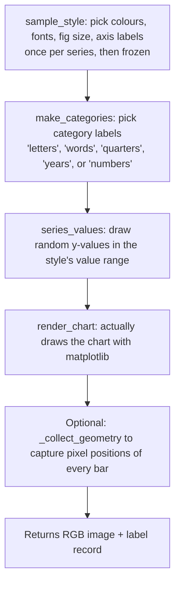

# Synthetic chart generation (gentle version)

> Senior version: [../Synthetic.md](../Synthetic.md).

This document explains how we make fake charts (with known answers) to
test extractors against.

## Why we make fake charts

Imagine you're trying to measure how good a VLM is at reading bar charts.
You'd need:

1. A bunch of bar charts.
2. The **right answers** for every bar in every chart.

For real charts (scraped from papers, PDFs, the web), nobody knows the
right answers — that's exactly why we wanted a VLM in the first place.
Other teams have solved this by having an LLM **read** the chart and
calling that the right answer. But then you can't test the LLM against
itself — that's like grading your own homework.

Our solution: **draw the charts ourselves**. When we use matplotlib to
draw a bar chart, we're telling matplotlib exactly what numbers to use.
So we know the right answer **by construction**. No grading-our-own-
homework problem.

## What we can draw

The generator has a "catalog" — a menu of chart types you can pick from.
They're listed in `synthetic/config.py` as `CATALOG`.

| Alias | What it draws | Underlying chart type |
|---|---|---|
| `simple` | One series of vertical bars, one colour | bar_chart |
| `multicolor` | One series of vertical bars, but each bar a different colour from a gradient | bar_chart |
| `grouped` | Multiple series side-by-side | grouped_bar_chart |
| `stacked` | Multiple series stacked on top of each other | stacked_bar_chart |
| `horizontal` | Bars going sideways | horizontal_bar_chart |
| `line` | One line | line_chart |
| `2-line` | Two lines | line_chart |
| `3-line` | Three lines | line_chart |
| `multiline` | Two to four lines (random count) | line_chart |

You pick which to generate via `output_types = [...]` in the TOML config.

## Three ways to run the generator

Run it from the command line:

```bash
synthetic-bars --config config/synthetic_bars.toml
```

There are three modes:

### Mode 1: Density series (the default)

This is the **main** mode. It's a controlled experiment.

For each chart type you picked:
1. Sample one "style" (colours, fonts, axis labels) and **freeze it**.
2. Walk through `density_steps`. With the default
   `[4, 5, 7, 9, 10, 12, 15, 20, 25, 30]`, that's ten different bar
   counts.
3. For each density, draw **two** charts: one with value labels on the
   bars, one without. Both have the same data.

Why this matters: by holding the style constant and varying only the
density, we can measure "how does the extractor degrade as charts get
denser?" without style noise confounding the result.

### Mode 2: Random

```bash
synthetic-bars --random 200
```

Just generates 200 random charts. Each picks a random chart type, a
random density, a random resolution. No experimental control — just
variety. Good for stress-testing.

### Mode 3: Preview

```bash
synthetic-bars --preview
```

Generates one small thumbnail of every chart type in the catalog. Run this
first when you're trying out new generator settings — see what you'd be
producing before you generate thousands of images.

## How a chart actually gets drawn

Walk through one chart's life:



A "label record" is a Python dict that becomes one line in
`labels.jsonl`. We'll look at its shape below.

## What's in `labels.jsonl`

`labels.jsonl` is a "JSON Lines" file — each line is a separate JSON
object. One line per chart. The benchmark reads this file to know what
the right answers are.

Here's what one line looks like, annotated:

```jsonc
{
  "image": "simple_s0_d04_on_480.png",      // filename of the chart image
  "label1": "bar_chart",                     // the chart type — used for type accuracy
  "label2": {                                // the values — used for value accuracy
    "chart_type": "bar_chart",
    "preset": "simple",                      // which catalog alias
    "orientation": "v",                      // vertical
    "axes": {                                // axis metadata
      "x": {"title": null, "scale": "category"},
      "y": {"title": "Revenue", "unit": "$M", "scale": "linear",
            "range": [0.0, 1000.0]}
    },
    "value_range": [0.0, 1000.0],            // the y-axis range
    "series": [                              // here's the truth!
      {"name": "Revenue",
       "points": [["A", 412.0], ["B", 158.0], ["C", 730.0], ["D", 211.0]]}
    ],
    "confidence": 1.0                        // synthetic data is always 1.0
  },
  "geometry": {                              // pixel positions (if geometry_full)
    "image_size": [770, 480],
    "plot_area_px": [72, 41, 749, 410],     // where the plot is, in pixels
    "value_ticks": [...],                    // where the y-axis ticks are
    "items": [                               // each bar's bounding box
      {"series": "Revenue", "category": "A", "value": 412.0,
       "bbox_px": [110.4, 247.1, 213.7, 410.0]}
    ]
  },
  "meta": {                                  // info for reports/breakdowns
    "preset": "simple", "density": 4, "labels_on": true,
    "n_series": 1, "geometry_full": true, "resolution": 480,
    ...
  },
  "render": {                                // reproducibility info
    "figsize_in": [7.2, 4.5], "dpi": 107, "title": "Quarterly Results"
  }
}
```

Which parts the benchmark cares about:

- **`label1`** — the truth chart type. Used for the "type accuracy" metric.
- **`label2.series`** — the truth values. Used for per-bar scoring.
- **`label2.value_range`** — the value-axis range.
- **`meta`** — used to group results in the report (by preset, by density,
  by labels_on).

The rest (`geometry`, `render`) is for debugging and for future CV+OCR
work.

## What `geometry` is, and when you get it

A "geometry" record gives you, for every bar in the chart, the **pixel
coordinates** of where that bar lives on the image. Same for line markers
and y-axis tick positions.

This is useful for CV+OCR extractors — they can use it to verify that
they're detecting bars in the right place.

You don't always get geometry. The `geometry_full_prob` setting (default
`0.5`) controls what fraction of charts include it. The others have
`"geometry": null`.

How the pixel positions are computed:

```python
# Inside render.py, after matplotlib draws the figure:
def to_img(x, y):                            # data coords → image pixels
    xd, yd = ax.transData.transform((x, y))  # matplotlib does the work
    return [float(xd), float(h_px - yd)]     # flip Y (matplotlib's origin is bottom-left)
```

If you want to *see* the geometry, run with `--overlay`. It draws green
rectangles around each bar and red ticks on the y-axis, on top of the
chart image. You can eyeball that the boxes hug the bars correctly.

## Augmentation (making it look more real)

Real charts have noise — JPEG compression, slight blur, sensor noise.
Synthetic charts are pristine. To bridge that gap, pass `--augment` and
the generator will sometimes:

1. Re-encode the image as JPEG at random quality (35–90).
2. Add Gaussian noise.
3. Apply a slight Gaussian blur.

These are **realism-only** transforms — they don't move pixels around.
Why does that matter? Because the `geometry` data says "bar A is at pixels
(110, 247, 213, 410)". If we rotated or cropped the image, those numbers
would become wrong **silently**. So we don't do spatial transforms.

## Reproducibility

If you pass the same `--seed` and the same `--config`, you get the
**same** dataset, byte-for-byte. Same images, same `labels.jsonl`. Useful
for:

- Reproducing a benchmark result reported by a teammate.
- Diffing extractors fairly on identical inputs.
- Regression testing — if your code changes accidentally break the
  generator, the hash of `labels.jsonl` will change and you'll notice.

⚠️ **Don't rearrange `rng.*` calls inside the generator without thinking.**
The dataset is reproducible because the random draws happen in a specific
order. If you swap two `rng.uniform(...)` calls, every saved dataset will
generate different content. Note this before you "tidy up" generate.py
or style.py.

## The output folder, after a run

```bash
synthetic-bars --config config/synthetic_bars.toml \
               --overlay --sqlite --out train_data/synthetic
```

You'll end up with:

```
train_data/synthetic/
  images/
    simple_s0_d04_off_480.png       ← the chart images themselves
    simple_s0_d04_on_480.png
    simple_s0_d05_off_480.png
    ...
  labels.jsonl                       ← one line per image, the ground truth
  _debug/                            ← only with --overlay
    overlay_simple_s0_d04_off_480.png
    ...
  dataset.sqlite3                    ← only with --sqlite
```

### Filename conventions

For density series, the filename is:
```
{alias}_s{k}_d{NN}_{on|off}_{resolution}.png
```

- `alias` — the catalog alias (`simple`, `grouped`, etc.)
- `s{k}` — the style series index (0 if `per_type=1`, can be higher)
- `d{NN}` — the density step, zero-padded (so they sort)
- `on` or `off` — whether value labels were drawn on the bars
- `resolution` — image height in pixels

For random mode, the filename is `random_{NNNNN}_{resolution}.png`.

For preview mode, just `{alias}.png`.

## Headless matplotlib

If you've used matplotlib before, you might know that it tries to open a
window when you call `plt.show()`. On a server with no display, that
fails. We solve this by setting matplotlib's backend to `"Agg"` (which
just draws into memory) **before** any other code touches matplotlib.

This happens in `synthetic/_backend.py` (a one-line module) which gets
imported as the very first line of `synthetic/__init__.py`. As long as
you `import sci_fi_parser.accuracy.synthetic` first, you're safe.

## Common questions

- **"Can I make the generator draw pie charts?"** Not today. The catalog
  is bar and line families only. Adding pie charts would mean adding to
  `ChartType` in `schema.py` and writing a new render path. See
  [Extending.md](Extending.md).

- **"Why are some bars negative?"** With probability `allow_negative`
  (default 0.15), the y-axis range dips below zero, and bars can be
  negative. Realistic — some data is negative.

- **"Can I just have one image, no twin?"** The default mode always emits
  twins. If you only need one, use `--random N`, which has a
  configurable `value_labels_prob` instead.

- **"How big a dataset should I generate?"** Depends on what you're
  measuring. For a sanity check, 50-100 images is fine. For a real
  benchmark sweep, a few hundred per chart type is more typical.

## Sources

- `src/sci_fi_parser/accuracy/synthetic/_backend.py`
- `src/sci_fi_parser/accuracy/synthetic/__init__.py`
- `src/sci_fi_parser/accuracy/synthetic/config.py`
- `src/sci_fi_parser/accuracy/synthetic/style.py`
- `src/sci_fi_parser/accuracy/synthetic/render.py`
- `src/sci_fi_parser/accuracy/synthetic/generate.py`
- `src/sci_fi_parser/accuracy/synthetic/output.py`
- `src/sci_fi_parser/accuracy/synthetic/cli.py`
- `Dev Documentantion/Tools/TrainingData.md`
